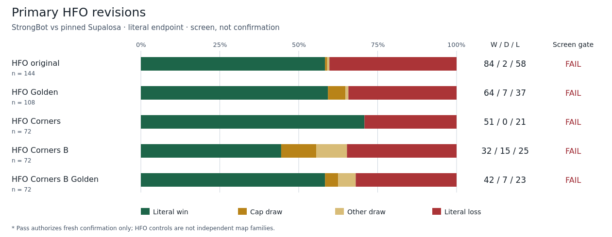
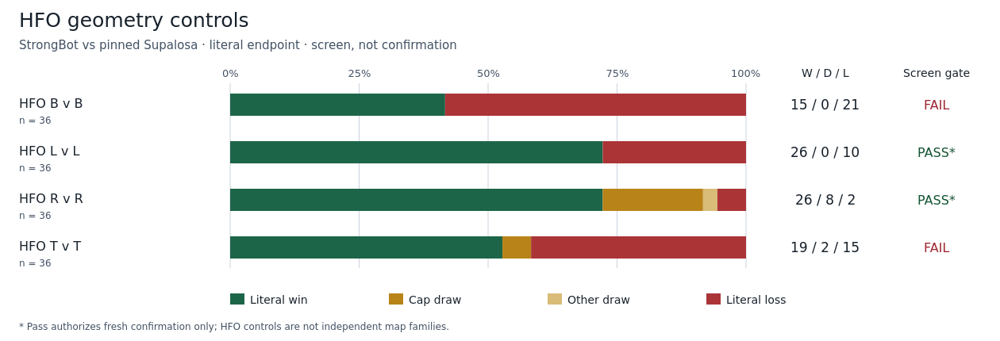
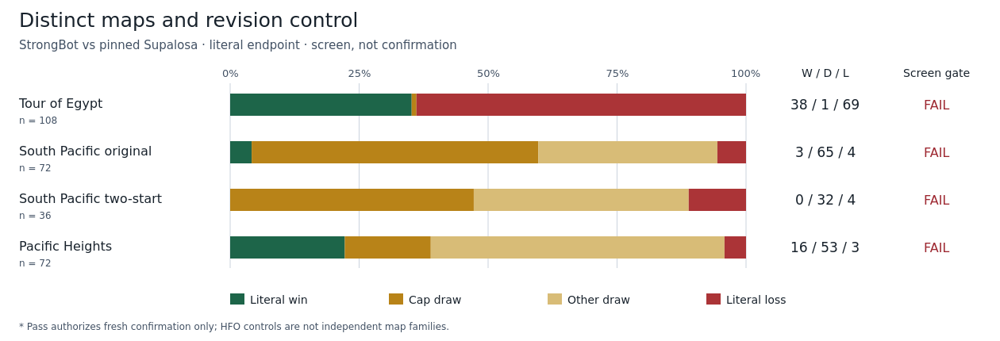

# Multi-map transfer screen: complete evidence

## Executive answer

Only **HFO L v L** and **HFO R v R** passed every frozen screen gate. These are
two geometry controls within the HFO family, not two independent-map successes.
Both remain unconfirmed under the stricter fresh-case gates.

Across all 900 games, the descriptive launch total is 416 wins, 192 draws and
292 losses. It is not a family-balanced performance estimate: sample counts
and related-map representation differ. All 13 map outcomes are retained.

## Configuration contract

| Knob | Frozen setting | Status |
|---|---|---|
| Candidate | Deployed StrongBot, unchanged | Default only |
| Opponent | External Supalosa at 165b77a | Pinned baseline |
| Maps | 13 exact new files; HFO LE/Peak historical evidence separate | Complete |
| Starts | Explicit, immutable amended allocation | Validated interface |
| Countries / slots | All nine countries / both slots | Exact coverage |
| Victory | Opponent-attributed destruction of all enemy buildings | Literal |
| Cap / resignation | 90,000 updates / neither quit forwarded | Fixed |
| Adapted policies / Advanced | Not evaluated by this screen | Separate studies |

All competitive results were opened only after all 900 cells and finalizer
completed 0:0 on pi_jss233. No game was retried or excluded.

## Primary HFO revisions



| Map | W / D / L | Win rate | 95% win lower | Gate |
|---|---:|---:|---:|---|
| HFO original | 84 / 2 / 58 | 58.3% | 51.5% | Fail |
| HFO Golden | 64 / 7 / 37 | 59.3% | 51.3% | Fail |
| HFO Corners | 51 / 0 / 21 | 70.8% | 61.4% | Fail |
| HFO Corners B | 32 / 15 / 25 | 44.4% | 35.2% | Fail |
| HFO Corners B Golden | 42 / 7 / 23 | 58.3% | 48.6% | Fail |

[Full map audit](visual_tables/map_summary_full_audit.csv) · [All strata](visual_tables/strata_full_audit.csv)

## HFO geometry controls



| Map | W / D / L | Win rate | 95% win lower | Gate |
|---|---:|---:|---:|---|
| HFO B v B | 15 / 0 / 21 | 41.7% | 29.2% | Fail |
| HFO L v L | 26 / 0 / 10 | 72.2% | 58.7% | Screen pass |
| HFO R v R | 26 / 8 / 2 | 72.2% | 58.7% | Screen pass |
| HFO T v T | 19 / 2 / 15 | 52.8% | 39.4% | Fail |

[Full map audit](visual_tables/map_summary_full_audit.csv) · [All strata](visual_tables/strata_full_audit.csv)

## Distinct maps and revision control



| Map | W / D / L | Win rate | 95% win lower | Gate |
|---|---:|---:|---:|---|
| Tour of Egypt | 38 / 1 / 69 | 35.2% | 28.1% | Fail |
| South Pacific original | 3 / 65 / 4 | 4.2% | 1.7% | Fail |
| South Pacific two-start | 0 / 32 / 4 | 0.0% | 0.0% | Fail |
| Pacific Heights | 16 / 53 / 3 | 22.2% | 15.3% | Fail |

[Full map audit](visual_tables/map_summary_full_audit.csv) · [All strata](visual_tables/strata_full_audit.csv)

## Interpretation and failure decomposition

- Primary HFO revisions show aggregate promise but fail robust coverage.
  Original HFO: 84/2/58, yet West (39,82) is 4/0/14 and only seven countries
  are noninferior. Golden: 64/7/37, with (50,121) at 1/0/17.
  Corners: 51/0/21, but West is 5/0/13. Favorable pooled records do not rescue
  these failed start gates.
- L v L passes at 26/0/10 with West only tied at 9/0/9. R v R passes at
  26/8/2. Their stricter confirmations may still fail; neither is called
  dominated or robustly confirmed here.
- Tour of Egypt is 38/1/69 and fails all principal balance gates.
- South Pacific original is 3/65/4; its two-start revision is 0/32/4.
  Pacific Heights is 16/53/3 and fails a start gate. These outcomes do not
  establish effective general land/naval or bridge play.

Of 192 draws, 97 reached the update cap and 95 were engine terminations without
the required literal physical-win certificate. They remain draws. They are
not all prolonged stalemates, and this report does not attribute them to
navigation or closeout without further prespecified diagnostics.

## Uncertainty and advancement

Win rate uses literal wins / all games, including draws in the denominator.
Score rate is (wins + 0.5 draws) / games. The table's bound is the one-sided 95%
Wilson win-probability lower bound (z = 1.644853626951), descriptive at screen
stage, not a new gate. Conditional win-time medians describe wins only.

The exact gates are: wins exceed losses overall, in both factions and slots;
every start has wins at least losses; at least eight countries are noninferior;
all technical and literal-win checks pass. A separate paired-deployed-control
gate is inapplicable to this single zero-shot head-to-head, but remains required
for later adaptation.

Only L v L and R v R may advance unchanged, on 144 uninspected confirmation
cases each. Failed maps require prospective development on amended screen
indices only. The manuscript remains frozen and Advanced remains unresolved.

## Audit and limitations

Every cell checksum/marker, scheduler identity, source/program/allocation
binding, case/seed/start identity and literal-win certificate was rechecked.
The script recomputes every map summary/gate from the complete aggregate.
All cells share the same captured runtime/software/environment identity.

The actual imported StrongBot package was also compared after completion with
the recorded root dist tree: 232 files, SHA
c2bfaf67767ef675fbce2f6c00c6164d77f93a2f58501cd9f4424175996598fc,
matching the captured candidate tree. The generic provenance game-api tree
points to the root compatibility installation; the evaluated import is separately
bound by the original/effective runtime hashes below. Do not conflate these paths.

The historical seed audit covered retained text metadata, not all off-tree
archives, log suffixes or encodings. Its exclusions remain explicit in the
prior audit report. Related HFO revisions form one family; the old HFO LE and
Peak populations are not pooled as if they shared this forced-pair design.

## Lineage and artifact index

- Array: 24603573; finalizer: 24603574; source:
  a60efffa5f321f828ce1a6b7178b4a7c31483c31.
- Screen aggregate: 8e760c72605cbe6c67fcc088cba5a3e460fecf53f28b4b614158abe050bef341.
- Canonical allocation: 5a838bd9cb3edf06df288914ad5cea60b61983f29d183a1efdeb5a3c90e3295e.
- Census: 5715eef27a8dc0b4b24f3ea2909c83ef2d15c3ea546a7c16b9b3a61b1583d1c5.
- Amendment: 1e992a30ee6b7978cff0842c05c94478412f69d77434156023aec479ce9a6760.
- Program: e87fc92b01a072959125780a8e961d0e22854ad4b5759a963f861233a26a61ef.
- Original runtime: dd398f5c8c2b4c3e3d6eb0f9ca6d7549bf70fee16c5950cd8902616ac922497d.
- Effective runtime: 4ad4a5dd7a6a8ae53a7e671a29d7dd0a5fbad1916d94e52c69c9eda133a30f0c.
- Raw aggregate: /nfs/roberts/project/pi_jss233/zc362/chrono_divide/research-evidence/multimap-v2/screen-amendment-3/finalizer/screen.json.
- [Map audit](visual_tables/map_summary_full_audit.csv), [stratum audit](visual_tables/strata_full_audit.csv),
  [900-cell provenance audit](visual_tables/cells_full_audit.csv).
- [Validation record](validation.json). Figure and no-image variants derive
  from the same immutable input; no figure uses partial results.

## Reproduction

Run on Bouchet inside the project checkout:

```bash
/home/zc362/.local/share/node-v22.22.3-linux-x64/bin/node research/scripts/build-multimap-screen-report-v3.mjs
```

The builder validates evidence, regenerates all tables and three charts, and
checks links, PNG nonblankness, figure/table placement and text contrast.
